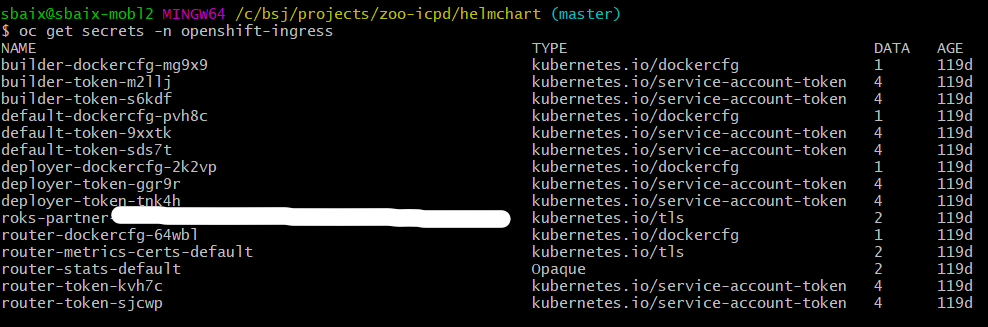

# Setup Analytics Zoo On IBM Cloud Pak for Data

Analytics Zoo is an open source project which is licensed under [Apache License 2.0](https://github.com/intel-analytics/analytics-zoo/blob/master/LICENSE).

## **Prerequisites**
To deploy Analytics Zoo on Cloud Pak for Data, the following prerequisites must be met:
1. Having an Cloud Pak for Data account with IBM and a working installation of Cloud Pak for Data on your cluster.
2. Having sufficient privileges to that cluster so that you can run kubectl/helm and log in to the Cloud Pak for Data internal docker registry.How to do this is described in the [Cloud Pak for Data Documentations](https://docs-icpdata.mybluemix.net/docs/content/SSQNUZ_current/com.ibm.icpdata.doc/zen/overview/overview.html)
3. The Analytics Zoo add-on is already bundled with required software which is enough for running deep-learning pipeline in Spark local mode. If you want to connect to another Spark cluster to do the AI pipeline with Analytics Zoo, please make sure it satisfies the software requirement including Spark 2.3.2, Python 3.6+, numpy<=1.14.5,>=1.13.3, tensorflow 1.10 on the cluster.
4. The minimum CPU requirement is 4 core.
5. The minimum memory request is 20G.
6. Setup helm by following 'Helm utility configuration' part in "CPD Openshift Cluster Remote Access" documentation from [Help Documentation](https://ibmplayground.com/partner/help/external). 

## **Work Flow**
Deploying Analytics Zoo on IBM Cloud Pak for Data uses the following workflow:

1. After logging into your cluster with your Cloud Pak for Data credentials in your web browser, find Analytics Zoo in the Add-ons section.
2. Open the menu in the corner of the Analytics Zoo tile and click Get Started.
3. You are then forwarded in your browser to this page (the one you are reading).

## **Installation**

### **To install the service on a cluster that can connect to the internet**
Follow the steps to have the Analytics Zoo up and running on your cluster.

1.  SSH to the Cloud Pak for Data cluster
```
ssh root@<cloud-pak-for-data-cluster-master-node>
```
2. Clone the github repository intel-analytics/zoo-icpd to receive a copy of the helmchart. Browse to the helm charts directory.
```bash
git clone https://github.com/intel-analytics/zoo-icpd.git
cd zoo-icpd/helmchart/analytics-zoo
```
3. Install the helmchart archive:
```bash
helm install --namespace zen --set addon.openUrl=https://analytics-zoo-addon-zen.<public_host_name_of_the_cluster>/tree?token=1234qwer analytics-zoo .
```
### **To install the service on an air-gapped cluster**

1. For cluster admininstrator, pre-download image and push to internal cluster registry.

    a. Download analytics zoo image with such command:
    ```bash
    docker pull intelanalytics/analytics-zoo:0.5.1-2.3.1-0.8.0-py3-icpd
    ```
    b. Log in to the oc command-line interface before push the image:
    ```bash
    oc login
    ```
    c. Login to internal registry server.
    
    To check the route of internal docker registry, run this command:
    ```bash
    oc get route/docker-registry -n default --template {{.spec.host}}
    ```
    The command returns a route similar to docker-registry-default.apps.my_cluster_address.
    
    Then, login to this internal docker registry route:
    ```bash
    docker login -u <oc admin login user> -p <oc admin docker registry password> docker-registry-default.apps.my_cluster_address
    ```
    "oc admin docker registry password" would be the output of "oc whoami -t"
    
    d. Push analytics zoo image to internal registry.
    ```bash
    docker tag intelanalytics/analytics-zoo:0.5.1-2.3.1-0.8.0-py3-icpd docker-registry-default.apps.my_cluster_address/zen/analytics-zoo:0.5.1-2.3.1-0.8.0-py3-icpd
    docker push docker-registry-default.apps.my_cluster_address/zen/analytics-zoo:0.5.1-2.3.1-0.8.0-py3-icpd
    ```
2. For user who will install analytics zoo add-on.

    a. Clone the github repository intel-analytics/zoo-icpd to receive a copy of the helmchart. Browse to the helm charts directory.
    ```bash
    git clone https://github.com/intel-analytics/zoo-icpd.git
    cd zoo-icpd/helmchart/analytics-zoo
    ```
    b. Get the internal name of the Red Hat OpenShift registry service:
    ```bash
    oc registry info
    ```
    The command returns a registry service similar to `docker-registry.default.svc:5000`
    
    c. Install the helmchart archive by pulling from internal registry:
    ```bash
    helm install --namespace zen --set addon.openUrl=https://analytics-zoo-addon-zen.<public_host_name_of_the_cluster>/tree?token=1234qwer --set Image=<image-registry.default.svc:5000>/zen/analytics-zoo analytics-zoo .
    ```

### **Verify Analytics Zoo deployment**
Run the following kubectl commands to verify the deployment.
```bash
kubectl get svc -n zen|grep analytics-zoo
kubectl get pod -n zen|grep analytics-zoo
kubectl describe pod <the_pod_it_made> -n zen
```
```bash
kubectl describe svc analytics-zoo-analytics-zoo -n zen
```
### **Create route to expose Analytics Zoo service**
There are two ways to create routes based on different protocols,one way is to create a route based on the http protocol in a simple way, and the other is to create an edge route to implement https.

1. create a route based on http protocol

    Analytics Zoo service can be exposed by creating a route with such command:
    ```bash
    oc expose service analytics-zoo-analytics-zoo -n zen  --name=analytics-zoo-addon
    ```

2. Create a route based on https protocol

    a. You need the kubernetes.io/tls type TLS secret that’s generated for your cluster:
    ```bash
    oc get secrets -n openshift-ingress
    ```
    

    b. Generate the secret in a temporary directory:
    ```bash
    oc extract secret/<YOUR-TLS-SECRET-NAME> --to=./ -n openshift-ingress
    ```

    c. Create route with generated secret files.
    ```bash
    oc create route edge analytics-zoo-addon --service analytics-zoo-analytics-zoo --namespace zen --key ./tls.key --cert ./tls.crt
    ```

So the Analytics Zoo addon service can be accessed with URL:
https://analytics-zoo-addon-zen.Public_Hostname_Of_The_Cluster

## Using Analytics Zoo
After you install the Analytics Zoo add-on, you can click "Open" link in the Analytics Zoo Add-on page, then you'll see the Jupyter notebook with Analytics Zoo. 

You can find many use cases/examples under current directory. Click one example and follow the README to open one notebook to run. 

Or you can create your own notebook with Analytics Zoo APIs to do your deep learning analytics. 

To get the detail information of how to use analytics zoo, please check [Analytics Zoo documentation](https://analytics-zoo.github.io)

## **Uninstall Analytics Zoo Add-on**
To uninstall/delete the analytics-zoo deployment:
```bash
helm uninstall analytics-zoo -n zen
```
